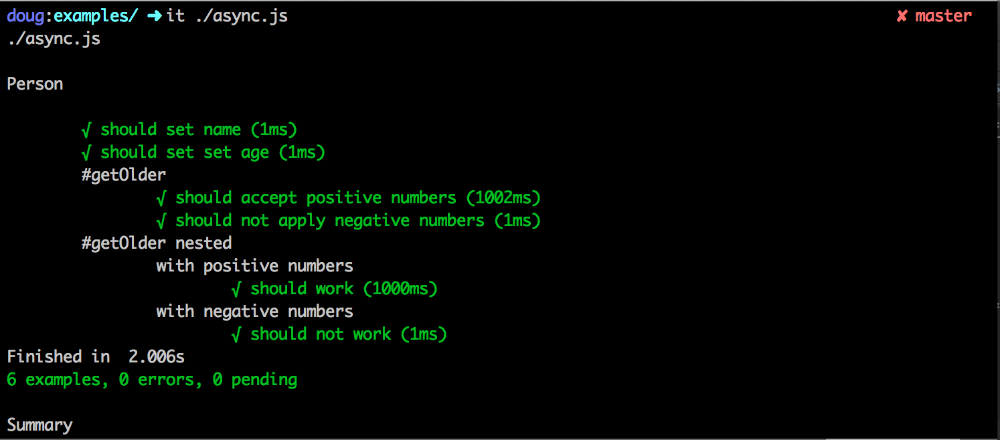
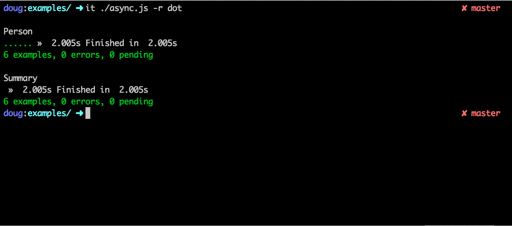
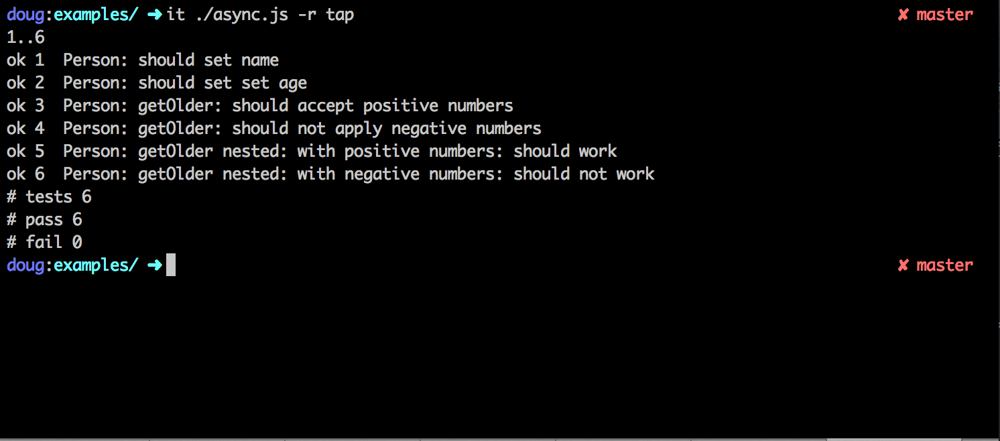

[](https://travis-ci.org/doug-martin/it)

[](http://ci.testling.com/doug-martin/it)

# It

## Overview

It is a testing framework for node.js and the browser.

 **Features**

  * Supports Promises, and the mocha `done(err)` style of async tests.
  * Browser Support
  * Node.js Support
  * Multiple Reporters
  * Proper exit codes for ci
  * Multiple reporters, including TAP for testling ci
  * Does not export global variables, you can run your tests individually with node or with the it executable.
  * Support for filtering tests.

## Installation

    npm install it

To use the it executable

    npm install -g it

In the browser

```html
<!DOCTYPE html>
<html>
    <head>
        <meta http-equiv="X-UA-Compatible" content="IE=edge">
        <meta charset="utf-8">
        <title>It Tests</title>
        <link rel="stylesheet" type="text/css" href="it.css">
    </head>
    <body>
    <div id="it"></div>
    <script src="it.js"></script>
    <script>
        //optionally export assert as a global
        assert = it.assert;
    </script>
    <!--Import your scripts-->
    <script>
        it.run();
    </script>
</body>
</html>
```

## Usage

### Synchronous tests

Writing synchronous tests in **It** is extremely simple. So lets start off with an example.

Lets assume we have a Person Object

```javascript 
var Person = function (name, age) {
    this.name = name;
    this.age = age;

    this.getOlder = function (years) {
        if (years > 0) {
            this.age = this.age + years;
        }
    };

};
```

The first tests we could run on person could be testing the setting of name and age.

```javascript

var it = require("../index"),
    assert = require("assert");

it.describe("Person", function (it) {

    it.should("set set name", function () {
        var person = new Person("bob", 1);
        assert.equal(person.name, "bob");
    });

    it.should("set set age", function () {
        var person = new Person("bob", 1);
        assert.equal(person.age, 1);
    });
    
});    
    
```
Notice we use the **it** passed back to the describe callback.

Next we could test different scenarios of Person#getOlder

```javascript
var it = require("../index"),
    assert = require("assert");

it.describe("Person", function (it) {

    it.describe("#getOlder", function (it) {

        it.should("accept positive numbers", function () {
            var person = new Person("bob", 1);
            person.getOlder(2);
            assert.equal(person.age, 3);
        });

        it.should("not apply negative numbers", function () {
            var person = new Person("bob", 1);
            person.getOlder(-2);
            assert.equal(person.age, 1);
        });
    });

});

```

In this example we are describing the **getOlder** method and run different tests against it. 
Notice the **it** passed back is used again.

You may nest tests as deep as you like as long as you remember to use the proper **it**. 

```javascript
it.describe("#getOlder nested", function (it) {

    it.describe("with positive numbers", function (it) {
        
        it.should("work", function () {
            var person = new Person("bob", 1);
            person.getOlder(2);
            assert.equal(person.age, 3);
        });
        
    });

    it.describe("with negative numbers", function () {
        
        //uh oh wrong it 
        it.should("not work", function () {
            var person = new Person("bob", 1);
            person.getOlder(-2);
            assert.equal(person.age, 1);
        });
        
    });

});
```

### Asynchronous tests

Writing asynchronous tests in **It** is just as easy as writing synchronous tests.

Lets modify Person to make get older async

```javascript
var Person = function (name, age) {
    this.name = name;
    this.age = age;

    this.getOlder = function (years, next) {
        setTimeout(function () {
            this.age = this.age + years;
            next(null, this);
        }.bind(this), years * 500);
    };
};
```

Now that **getOlder** is async lets test it

In this example a promise is the return value. If you have used `comb`, `Q`, `promises-extedned` or any other framework that uses
**Promises** then this will feel pretty natural to you. The test will wait for the promise to resolve before  continuing any other tests.


```javascript

   var p = require("promise-extended");

   it.describe("#getOlder", function (it) {
       //return promise
       it.should("not apply negative numbers", function () {
           var ret = new p.promise();
           var person = new Person("bob", 1);
           person.getOlder(-2, function (err, person) {
               assert.equal(person.age, 1);
               ret.callback();
           });
           return ret.promise();
       });
   });
```

In this exampke the should callback accepts a `next(err)` argument which is a function that should be called when the current test is done. So if next is invoked with a first argument other than null or undefined then
it is assumed that the test errored.

```javascript

   it.describe("#getOlder", function (it) {
       //Call with next
       it.should("accept positive numbers", function (next) {
           var person = new Person("bob", 1);
           person.getOlder(2, function (err, person) {
               assert.equal(person.age, 3);
               next();
           });
       });
   });
```

### Running Tests

To run tests there are two options the **it** executable 

Options
  
  * -d, --directory : The root directory of your tests
  * -f --filter : A filter to apply to run certain behaviors/suites/tests
  * -r, --reporter : The reporter to use when running the tests
  * --cov-html : create coverage output in html, if an output path is included then the file will be written to that file otherwise it will defalt to `./coverage.html`
  * --reporters : Display a list of reporters that are available
  * -h, --help : Displays help.

To run an entire suite

    it -d ./mytests -r dotmatrix


To run an individual test

    it ./mytests/person.test.js
Or

    it -f "Person"
    
To run the #getOlder spec

    it -f "Person:#getOlder"

    

You can alternatively run the test directly

```javascript

it.describe("A Person", function(it){

     it.should("set set name", function () {
        var person = new Person("bob", 1);
        assert.equal(person.name, "bob");
    });

    it.should("set set age", function () {
        var person = new Person("bob", 1);
        assert.equal(person.age, 1);
    });
    
    it.run();

});

```

You can also filter the tests to run from within the test

```javascript

it.describe("A Person", function(it){

     it.should("set name", function () {
        var person = new Person("bob", 1);
        assert.equal(person.name, "bob");
    });

    it.should("set age", function () {
        var person = new Person("bob", 1);
        assert.equal(person.age, 1);
    });

}).run("should set name");

```

## Tdd

`it` also supports tdd style tests.

```javascript

it.suite("Person", function (it) {

    it.suite("#getOlder", function (it) {

        it.test("accept positive numbers", function () {
            var person = new Person("bob", 1);
            person.getOlder(2);
            assert.equal(person.age, 3);
        });

        it.test("not apply negative numbers", function () {
            var person = new Person("bob", 1);
            person.getOlder(-2);
            assert.equal(person.age, 1);
        });
    });

});

```

### Code Coverage
If you use [node-jscoverage](https://github.com/visionmedia/node-jscoverage) to generate coverage then by default `it`
will output a coverage report. You may also output coverage to an `HTML` file by passing in the `--cov-html` flag to the executable.
For example out put see [patio test coverage](http://c2fo.github.com/patio/coverage.html).


### Reporters

**`spec`**



**`dot`**



**`tap`**



**`doc`**


**`html`**


### Assert extensions

The following methods are added to assert for convenience

  * `lengthOf` - assert the length of an array
  * `isTrue` - assert that a value is true
  * `isFalse` - assert that a value is false 
  * `isRegExp` - assert that a value is a Regular Expression
  * `isArray` - assert that a value is an Array
  * `isHash` - assert that a value is a plain object
  * `isObject` - assert that a value is a object
  * `isNumber` - assert that a value is a Number
  * `isDate` - assert that a value is a Date
  * `isBoolean` - assert that a value is a Boolean
  * `isString` - assert that a value is a String
  * `isUndefined` - assert that a value is undefined
  * `isUndefinedOrNull` - assert that a value is undefined or null
  * `isPromiseLike` - assert that a value is Promise like (contains the funtions "then", "addErrback", and "addCallback")
  * `isFunction` - assert that a value is a function
  * `isNull` - assert that a value is null
  * `isNotNull` - assert that a value is not null
  * `instanceOf` - assert that a value is an instanceof a particular object
  * `truthy` - assert that the value is truthy.
  * `falsy` - assert that the value is falsy.

### License


MIT <https://github.com/doug-martin/it/raw/master/LICENSE>

### Meta

* Code: `git clone git://github.com/doug-martin/it.git`
